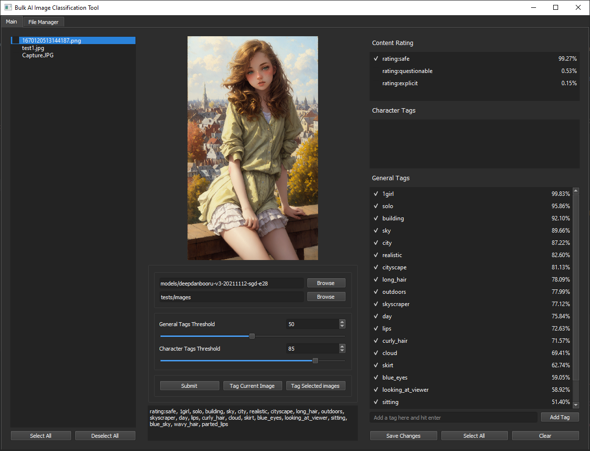

# Bulk AI Image classification Tool

An image tagger based on deepdanbooru AI



## Installation and Running
### Prerequisites
+ Python 3.7+
+ Windows 10/11
### Installation on Windows 10/11 using release package
Soon

### Building from source
Assuming you've already set up the virtual environment
```bash
pip install -r requirements.txt
pip install .
python gui.py
```
## Models
Models are not included, must be downloaded seperately. Currently only supports deepdanbooru

### DeepDanbooru
Anime style image classification model based on the Gwern 2021 dataset. Best used for tagging digital drawings but also preforms well enough other mediums.

Download: https://github.com/KichangKim/DeepDanbooru/releases

### Custom Models
For the time being models should be in the following format:
```
/dd-image-tagger/
└── /models/
    └── /model_name/
        ├── model-resnet_custom_v3.h5 (required)
        └── tags.txt (required)
        └── tags-character.txt (optional)
```
- Models and tags are loaded via action_box's load_model and load_tags function, which look for the above files respectively